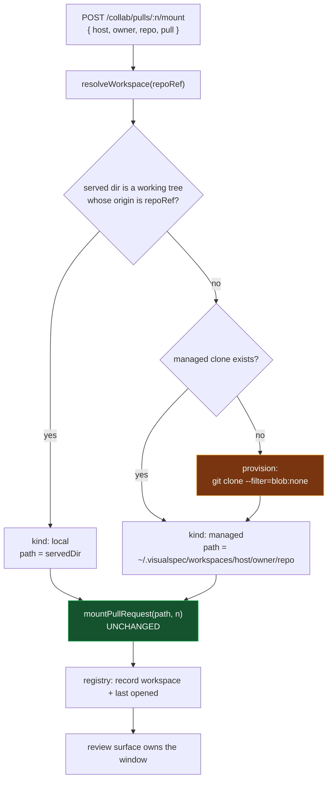

# Collaboration Workspace — Low-Level Design

## Architecture

### The shape of the change

Today `mountPullRequest(baseDir, n)` is handed one `baseDir` — the served directory,
supplied by a thunk (`baseDir: () => contentDir`). Everything downstream of that argument
already works. This change replaces the thunk with a **resolver** that answers a different
question:

> Given the repository this pull request belongs to, which directory should host its
> checkout?

`mountPullRequest` itself is unchanged. It gains no knowledge of workspaces, homes, or
provisioning; it keeps taking a `baseDir` that is a git working tree with an `origin`, and
the resolver's whole job is to guarantee it gets one.



### Layout on disk

```
~/.visualspec/                          VISUAL_SPEC_HOME overrides the root
├── registry.json                       every workspace opened or provisioned
└── workspaces/
    └── github.com/
        ├── acme/docs/                  blobless clone
        │   ├── .git/
        │   └── .visual-spec/
        │       └── worktrees/pr-42/    existing worktree.ts, unchanged
        └── other-org/service/
            └── .visual-spec/worktrees/pr-7/
```

Keyed `host/owner/repo` so a second forge is not designed out, and so two repositories
with the same name under different owners cannot collide. The per-clone interior is
identical to what a served directory gets today, which is what lets `worktree.ts` stay as
it is: `WORKTREE_DIR`, `ensureIgnored`, `refs/visual-spec/pr/<n>` all apply unchanged.

### Registry

`registry.json` holds one entry per workspace, of two kinds:

| Field | Meaning |
| --- | --- |
| `kind` | `managed` — provisioned by `visual-spec`, removable. `local` — a directory the user served, recorded for reopening only. |
| `host`, `owner`, `repo` | The repository, when known. A `local` entry with no parsable origin has none. |
| `path` | Absolute path. For `managed`, always inside the workspace root. |
| `lastOpenedAt` | Sort key for the recents list. |
| `pulls` | Pull request numbers with a checkout currently mounted, for display and for cleanup. |

The registry is a **cache of facts about the filesystem, never the authority**. Every read
reconciles against disk: an entry whose path is gone is dropped, and mounted checkouts are
re-derived from `git worktree list --porcelain` rather than trusted from `pulls`. This is
the same discipline `listMountedWorktrees` already applies for exactly the same reason —
a directory removed with `rm -rf` must not be reported as available.

### Resolution rule

```
resolveWorkspace(repoRef):
  ctx = readGitContext(servedDir)
  if ctx.state == 'remote' and (ctx.host, ctx.owner, ctx.repo) == repoRef:
      return { kind: 'local', path: servedDir }
  return { kind: 'managed', path: ensureManagedClone(repoRef) }
```

`readGitContext` and its comparison inputs already exist and are already used to infer
`owner/repo` from the served directory. The rule adds no new detection: it reuses the one
signal the system already trusts, and treats every other outcome as "provision".

Deliberately **not** in the rule: any search of the registry's `local` entries, any
filesystem scan, any prompt. Reuse is decided from the served directory alone. A user with
five clones of the same repository gets a predictable answer instead of a guess.

### Provisioning

`ensureManagedClone(repoRef)` is idempotent and concurrency-safe:

1. If the target path is already a working tree with a matching `origin`, return it.
2. Otherwise clone into a temporary sibling directory, then `rename()` into place — so a
   half-finished clone is never observable at the real path, and a crash leaves garbage
   that the next reconcile can drop rather than a broken workspace.
3. Concurrent requests for the same repository coalesce onto one in-flight clone.

`--filter=blob:none` is the clone form: full history and full tree structure, blobs
fetched on demand. A reviewer wants one commit's worth of file contents, and paying for
every blob in history to get it is the cost that makes "just clone it for them" feel
wrong. The trade is that browsing a file in the checkout can hit the network.

Clone URL comes from the same credential path as everything else — `gh` supplies
authentication, so a private repository the user can read is a repository they can
provision.

### Multi-repository requests

Every route that reaches a workspace must name its repository. Today `/pulls/:n/mount`
carries only a number because the repository is server-wide configuration. The route
family gains an explicit repository reference, and the server-wide `collaboration.owner` /
`.repo` becomes the **default** used when a request omits one — which is what keeps every
existing single-repository call working unchanged.

The client-side consequence: `parsePullRequestReference` currently extracts only the digits
from a pasted URL and discards the `owner/repo` in it. It must return the repository too,
which is what makes SC-5 possible and closes the gap where the panel already advertises
"for a pull request in another repository".

### Discovery

Two entry points, no repository configuration required for either:

- **Involving me** — one search query for open pull requests where the user is author,
  reviewer, assignee or mentioned. Returns rows carrying their own repository, so a
  reviewer invited to a repository they have never heard of sees it. Rate limits and the
  search API's eventual consistency are its known costs; the list is a discovery aid, not
  a source of truth about a pull request's state.
- **Pasted URL** — the fallback, now carrying its repository.

The existing per-repository listing stays for the configured repository.

### The review surface

Reviewing takes the window and hands it back. The served directory is never re-rooted:
`setRoot` is not called, `contentDir` does not move, the comments sidecar does not follow,
and the file tree returns to the user's project when the review closes. The review's own
tree is rooted at its checkout path, which is how the existing PR review surface already
works — it simply now sometimes points into the managed root.

Reopening a workspace from the recents list is the one case that *does* re-root, and only
for `local` entries. That is a new capability with a security consequence, handled below.

### Removal

Two triggers, both explicit about what they touch:

- **User removes a managed workspace** — unmount every checkout, delete its private
  references, then delete the clone directory. Only `managed` entries are removable.
  Removing a `local` entry drops the registry row and touches no files.
- **A pull request ends** — when a mounted pull request is observed merged or closed, its
  checkout is unmounted and its reference deleted. The clone stays. This extends the
  existing merge-time cleanup rather than inventing a second lifecycle.

## Constraints

- **One `git` seam, one `gh` seam.** Every git subprocess goes through the existing
  `GitExecutor`; every GitHub call through the existing `gh` executor. `clone` becomes the
  second network-touching git command after `fetch`, and must not acquire a second spawn
  site.
- **All GitHub access is server-side.** The credential lives in the node process and never
  reaches the browser. Unchanged by this design.
- **Failures are values.** No new throw-based path. Provisioning reports a distinct reason
  per fixable cause, the way mount failures already do.
- **No absolute path leaks where one is not asked for.** `readGitContext` deliberately
  keeps `dir` out of its return value because git writes absolute paths into stderr. The
  workspace list is the one place paths are surfaced, because the user asked to see their
  workspaces; error messages must keep the existing discipline.
- **Path containment.** Managed paths are derived from `host/owner/repo` segments that
  arrive from a request. They must be validated before reaching `join()` — the same
  argument `assertPullNumber` makes for pull numbers, extended to repository components.
  An `owner` of `..` must be refused, not normalised.
- **Re-rooting from a path is not a free capability.** `/__vs/dir/pick` today requires a
  human at an OS folder picker; the server never accepts a caller-supplied directory to
  serve. Reopening from the recents list must accept only paths that are already registry
  entries, so the route cannot be turned into "serve any directory on this machine".
- **`.visual-spec/` must be ignored before a checkout exists** inside a managed clone, as
  it is inside a served one.
- **Two hosts, one route layer.** Resolution and provisioning live in shared code; neither
  host branches.
- **Node builtins and sibling core modules only** in anything the CLI reaches, per the
  existing bundle guard.
- **Local mode stays inert.** With no collaboration configured, nothing here constructs a
  workspace root, reads a registry, or creates `~/.visualspec/`.

## Key Decisions

**The resolver replaces the thunk; `mountPullRequest` is untouched.** The alternative —
teaching the worktree module about workspaces — would put provisioning behind the same
function that must stay a thin wrapper over four git commands. Keeping the decision above
it means the clone-free and clone-backed paths converge on one already-tested function.

**Blobless clone rather than bare, full, or API-materialised.** Bare would make `baseDir`
something `readGitContext`, the file tree and the branch chip have never seen. Full pays
for every blob in history to read one commit. Materialising trees through the API
re-introduces the per-file round trips that the worktree design exists to avoid. Blobless
keeps one code path and pays only for what is read, at the cost of network access during
browsing.

**Reuse is decided from the served directory alone.** A registry-driven or filesystem-scan
rule reuses more clones and makes the answer unpredictable — which of the user's copies,
in what state, on what branch. The served directory is the one clone the user has already
pointed at.

**Discovery is search-based, not registry-based.** The reviewer this feature exists for
has never opened the repository, so a registry-driven list would be empty exactly when it
is needed. The registry serves reopening; search serves discovery.

**The registry is a cache, not a source of truth.** Anything it claims about disk is
re-derived from git and the filesystem on read. The failure mode of trusting it — offering
a workspace that is not there — is worse than the cost of reconciling.

**Reviewing does not re-root.** Re-rooting would reuse existing machinery, and would make
the user's project vanish from the sidebar as a side effect of reading someone else's pull
request. The review surface already owns the window; it keeps doing so.

**Removal is explicit, plus end-of-pull-request release.** Staleness timers and disk
budgets need accounting, a clock, and a policy the user did not ask for, and they delete
things while nobody is watching. Not shipping them keeps the rule "your disk changes when
you or a merge says so".

**Temp-then-rename for provisioning.** A partially cloned directory at the real path is
indistinguishable from a usable workspace, and would be found by the "already exists"
check on the next attempt. Renaming in makes the path atomic.

## Out of Scope

- Automatic eviction by staleness or disk budget.
- Any forge other than GitHub, though the layout is keyed by host.
- Filesystem scanning for existing clones, and reuse of registry `local` entries.
- Two workspaces open simultaneously; a split or tabbed file tree.
- Commit, push, branch or merge against a managed clone.
- Migrating checkouts already mounted under a served directory.
- A background process, daemon, or scheduled cleanup.
- Sharing a workspace root between users or machines.
- Making the recents list a general "open any directory" control.
