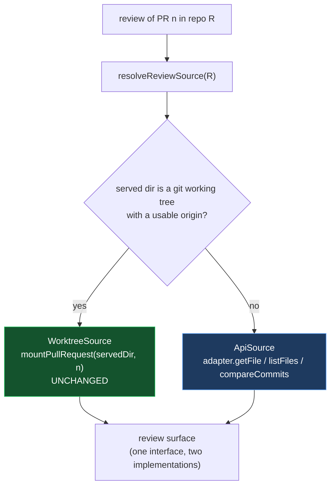

# Reviewing a Pull Request Without a Clone — Low-Level Design

> **Revision.** The managed root, provisioning, registry and eviction lifecycle described
> in the first draft are withdrawn. What survives is the one idea that review found sound:
> replacing the single `baseDir` thunk with a resolver. The resolver's other branch is now
> an API-backed source rather than a provisioned clone.

## Architecture

### The seam

`ui/collab-pr-review.tsx` reads the pull request through `/__vs/tree`, `/__vs/raw` and the
`/files` route. Its own header says it browses through `/__vs/tree` *because the checkout
happens to already be there* — a convenience, not a requirement. That makes the data source
substitutable, which is the whole change.



`ReviewSource` is the reusable artifact — one interface, two implementations. Four
operations, all of which both sides can answer:

| Operation | WorktreeSource | ApiSource |
| --- | --- | --- |
| changed paths | `/files` route (already API-backed on both) | same |
| list a directory | walk the checkout | `adapter.listFiles(repo, path, headSha)` |
| read a file | read from the checkout | `adapter.getFile(repo, path, headSha)` |
| head sha | `rev-parse HEAD` in the checkout | the pull request's head |

Every read is pinned to the head sha, not a branch name, so a force-push during a review
cannot silently swap the bytes under a comment being written.

### The resolution rule — corrected

The first draft said the served directory is used only when its origin *matches* the pull
request's repository. That is wrong, and would have broken a working case.
`fetchSource(originUrl, repo)` derives an explicit fetch URL on `origin`'s host when the
configured repository differs from `origin`, so today a reviewer serving repository **A**
can already mount a pull request of repository **B**. A match-only rule would have moved
that case from a checkout to the API, changing behaviour nobody asked to change.

```
resolveReviewSource(repoRef):
  ctx = readGitContext(servedDir)
  if ctx.state is 'remote' or 'local':          # a git working tree with an origin
      return WorktreeSource(servedDir)          # fetchSource handles the foreign case
  return ApiSource(repoRef)
```

So the API source is reached only in the case that refuses today: no git working tree, or
no origin to fetch from. `not-a-repo` and `no-origin` stop being terminal; the other two
mount failures are unchanged.

`fetchSource`'s explicit-URL branch stays live — it is the mechanism that keeps the
foreign-repo-in-a-local-clone case on the checkout path.

### Repository scoping — the omitted layer

Accepting a repository per request is not a routing change. `gate()` resolves
`gated.repo` from server configuration and every `/pulls/*` handler calls
`repoRefOf(gated.repo)` — seven call sites. Behind it, `availability()` caches per
`owner/repo#baseBranch@credential`, and the authorizer caches effective permission per
`owner/repo` and decides author-only versus any-role from it. Left alone, a foreign-repo
request is authorized against the *configured* repository's permissions.

Blast radius is small today because every `/pulls/*` operation is `read`/any-role, but it
is privilege confusion waiting for the first repo-scoped write. So:

- `gate(op, documentId, repoRef?)` takes the repository being acted on; absent, it means
  the configured one.
- `availability()` and preflight run per requested repository, keyed as they already are.
- The authorizer's permission cache is already keyed by `owner/repo` and needs no change —
  only its *input* was wrong.
- Review routes take `RepoRef` (host/owner/repo), not `ResolvedCollaborationConfig`, whose
  `baseBranch` is meaningless for a repository being reviewed rather than published to.

### Route shape

The repository goes in the path, not the body, and the old family keeps its meaning:

```
GET  /__vs/collab/repos/:host/:owner/:repo/pulls/:n/{files,description,…}   repo REQUIRED
POST /__vs/collab/repos/:host/:owner/:repo/pulls/:n/mount
GET  /__vs/collab/pulls/*                                  legacy — the configured repo
```

Four reasons for the path over a body field or header:

1. A client that omits the repository gets a 404, not a plausible wrong-repository review.
   The default stops being a fallback inside a new route and becomes a different, older
   route.
2. It is versionable — the legacy family can be deprecated and deleted independently. There
   is no API version scheme in this package, and a parallel family is the cheapest one.
3. `EventSource` cannot set headers — the same reason the request guard is not a token — so
   any header-borne parameter would break the SSE routes.
4. Segments are matched `[^/]+`, so a bare `..` cannot appear. `%2e%2e` can, so segments are
   **decoded, then validated**, and an invalid segment is refused rather than normalised.

Two shipped routes need care:

- `GET /pulls/mounted` answers from the served directory. It stays exactly that. Nothing
  else can be mounted, because nothing else is ever cloned.
- `DELETE /pulls/:n/mount` unmounts from the served directory. With no managed checkouts it
  cannot silently no-op against one, so the bug the first draft's "already absent is a
  completed release" would have masked does not arise.

Review drafts stay at `<servedDir>/.visual-spec/reviews/pr-<n>.json`, keyed by pull number.
Under multi-repository review that key is no longer unique, so the draft file gains the
repository in its identity. Five call sites pass `baseDir()` today and all five are in
scope.

### Amending Unit 13

R-13.9 is a closed enumeration of four causes, mirrored 1:1 by `WorktreeFailure`,
`MOUNT_FAILURE`, and a test asserting fourness. R-13.5 states flatly that a checkout lives
inside the served directory, and a UI comment cites it by number. Enumerated taxonomies and
flat factual claims cannot be amended from a second document without leaving the original
saying the opposite. **Both are edited in place**, and this document owns only what is new.

## Constraints

- **One `gh` seam, one `git` seam.** The API source adds no executor — it uses the adapter
  that already serves every other GitHub call. No new authentication path, which is what
  removes the `gh auth setup-git` trap the first draft would have introduced.
- **All GitHub access is server-side.** Unchanged.
- **Failures are values.** The API source reports network, credential and permission
  failures as values, in the same shape mount failures already use.
- **Reads are pinned to the head sha**, never a branch name.
- **Nothing is written outside the served directory.** Restored as an invariant. There is
  no home directory, no cache, no registry.
- **The request guard's rationale is preserved.** It allows an absent `Sec-Fetch-Site`
  because a non-browser caller "has no ambient authority to borrow". That reasoning holds
  only while routes act on the directory the user already chose. No route added here clones,
  writes outside, or changes what is served — so the rationale stays true. It would not have
  under the first draft.
- **Two hosts, one route layer.** Source selection lives in shared code. The bundle guard
  mechanically enforces this by failing any host source containing `writeFile(`, `mkdir(`
  or `readGitContext(`.
- **The bundle guard's `FORBIDDEN` list is three specifiers**, not a general dependency
  policy. Nothing here adds a dependency; if that changes, the list must be extended rather
  than the constraint asserted in prose.
- **Local mode stays inert** with no collaboration configured.

## Key Decisions

**API source rather than a provisioned clone.** The worktree design rejects the API on the
grounds that a reviewer wants the whole tree without N round trips. A `blob:none` clone
fetches blobs on demand — N round trips — after paying a full history clone for the
privilege, and `git worktree add` materialises every blob at the head commit regardless, so
the deferral only skips history. The argument does not survive its own implementation. The
API path costs one call per directory expanded and one per file opened, which is what the
surface already does, and adds no disk, no auth seam, no lifecycle.

**The worktree is kept, not replaced.** Where the user is already in a repository, objects
are local and they get real files. That is where the rationale is true. The mistake was
making it the only way.

**No managed root.** Provisioning would have required a root, an env override, lazy
creation, a path scheme, escape validation on request-supplied segments, atomic
provisioning, in-flight coalescing that is still wrong across processes, a failure
taxonomy, progress reporting, removal with reference cleanup, and reconcile-on-read. That
is a package manager's cache, and nothing else in this tool needs one.

**No registry.** It recorded served directories — a different feature — and introduced a
route that serves a caller-named path whose allowlist is a file in the user's home. The
tool has never read application state from outside the served directory, and that is worth
more than skipping the OS folder picker.

**No search discovery.** The reviewer holding a link has the repository in the link; the
code simply throws it away. Fixing that is a function returning three fields instead of
one. Search brings a different rate limit, eventual consistency, an empty-list-looks-broken
failure mode, and a listing of every repository the credential can read.

**Repository in the path, required.** Makes the omitted-parameter case a 404 instead of a
wrong-repository review.

## Out of Scope

- A managed repository root, provisioning, or any clone performed for the user.
- A workspace registry, recents list, or reopening a directory by path.
- Cross-repository pull request discovery.
- Offline review of a repository not on disk.
- Automatic eviction of anything, since nothing is provisioned.
- Any forge other than GitHub.
- Two projects open at once.
