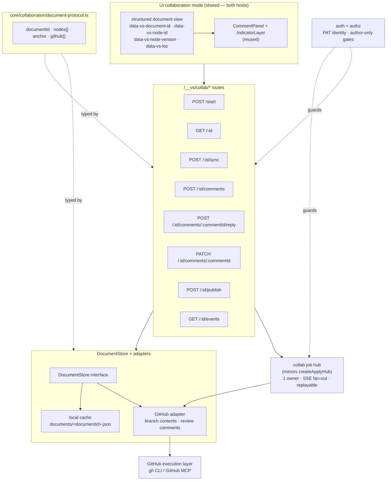
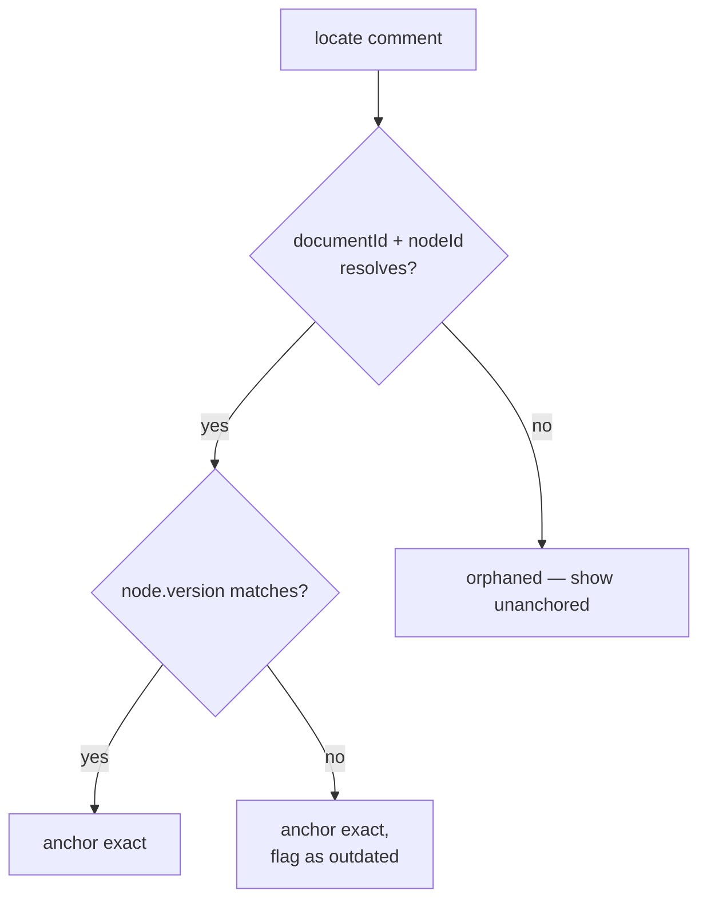
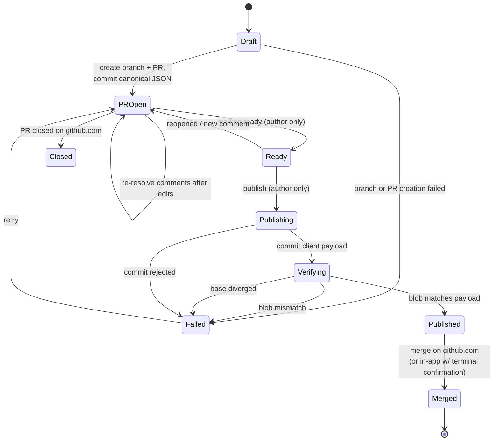

# GitHub PR-Based Collaborative Documents — Low-Level Design

## Architecture

### Layer map



### 1. Collaboration protocol model

New module `packages/visual-spec/core/collaboration/document-protocol.ts`, alongside the existing `core/editing/comment-doc.ts` rather than modifying it.

Fields absent from today's model that the protocol introduces:

- Document: `documentId`, `documentPath`, `title`, `nodes[]`
- Node: `node.id`, `node.type`, `node.version`, `node.content`
- Anchor: `anchor.nodeId`, `anchor.nodeVersion`, `anchor.github`
- GitHub: `github.owner`, `github.repo`, `github.branch`, `github.pullNumber`, `github.headSha`, `github.issueCommentId`, `github.replyToId`, `github.resolved`

The existing `CommentTarget` (`path` + `kind: 'file' | 'range' | 'folder'`) is untouched and continues to serve local comments. Collaborative comments use a target carrying `documentId` + `nodeId`.

**Frontmatter lives in the document envelope, not in `JsonDocument`.** `JsonDocument` is `{ root }` and has nowhere to hold it, but the persisted collaboration document is already a wrapper — `{ documentId, documentPath, title, frontmatter, doc: { root } }`. This matches what the editor does today (`markdown-doc-editor.tsx:107` splits frontmatter outside Lexical) and needs no owned node type. The YAML block is emitted by the same generation call as the rest of the Markdown, so it is covered by publish verification.

### 2. Canonical document format and `nodeId`

The canonical form is the Luthor `JsonDocument` (`{ root }`) from `@lyfie/luthor`, already a dependency of the WYSIWYG editor.

| Concern | Mechanism |
| ------- | --------- |
| JSON → Markdown (write-only) | `headless.jsonToMarkdown(doc, { metadataMode: 'none' })` |
| Markdown → JSON | **Not used for collaboration documents.** Reserved for local mode and for importing a plain Markdown file once, at document creation. |
| Non-representable nodes | `prepareDocumentForBridge(input, { mode, supportedNodeTypes })` is used to *detect* and *report* nodes the published Markdown will drop. No metadata envelopes are appended. |
| Capability check | `MARKDOWN_SUPPORTED_NODE_TYPES`, `isMarkdownRepresentable()` |
| Editor binding | `ExtensiveEditorRef.getJSON()` / `injectJSON()` — the editor is driven from structured state, not a markdown string |

**Markdown is derived, not canonical.** Because the JSON on the branch is the artifact of record, nothing ever needs to reconstruct a document from Markdown. This removes the entire round-trip class of failures — and it also removes the need for metadata envelopes, which existed only to make the return trip lossless. Envelopes are keyed by structural `path: number[]`, so they cannot survive an insertion above the node they describe; they were never a viable identity mechanism.

#### `nodeId` lives on the node, via owned node classes

Serialized Lexical nodes carry `type`, `version`, `format`, and children but **no stable key or id**, and `getJSON()` emits only what the node class declares. An extra property cannot simply be written onto a serialized `paragraph`: `injectJSON()` dispatches on the registered class for that type and will reject or discard an unknown field.

The mechanism is Lexical's supported **node replacement**, exposed by Luthor as `LexicalNodeRegistration = KlassConstructor<typeof LexicalNode> | LexicalNodeReplacement` and accepted through `createExtension({ nodes: [...] })` / `ExtensiveEditorProps.extraExtensions`. For each addressable block type, visual-spec registers a subclass that carries `nodeId` and supplies it with `{ replace, with, withKlass }`, so that **every node created inside the editor** — on Enter, on paste, on list toggle, on `enterKeyBehaviorExtension` — is constructed as the owned type rather than the Lexical base type.

```ts
// shape, per owned block type
class VsParagraphNode extends ParagraphNode {
  __nodeId: string;
  static getType() { return 'paragraph'; }   // ← unchanged on purpose
  exportJSON() { return { ...super.exportJSON(), nodeId: this.__nodeId }; }
  static importJSON(json) { /* … restores __nodeId … */ }
}
```

Two constraints govern this:

- **`getType()` must keep returning the base type string.** `MARKDOWN_SUPPORTED_NODE_TYPES`, the Markdown transformers, `isMarkdownRepresentable()`, and the toolbar all compare against literal type strings such as `'paragraph'`. A distinct `'vs-paragraph'` type would fall out of every one of them. Identity rides on the subclass; the type string does not change.
- **`withKlass` is mandatory.** A replacement supplied without it produces `importJSON` dispatch against the registered base class and fails deserialization ("Create node Type paragraph in node IdParagraphNode does not match registered node ParagraphNode with the same type").

A **backfill transform** assigns `nodeId` to any node that reaches the store without one — covering documents created before this ships and any node produced by a path that escapes the replacement. Backfill uses structural position and is best-effort; it is a repair mechanism, not the identity mechanism.

`node.version` is incremented when a node's content changes. It is not an identity rung — it only distinguishes "same block, changed since the comment was written" so a comment can be flagged outdated.

#### Fidelity guard

Because the reviewer's rendering and the published Markdown both derive from the JSON, a silent regression in the editor's serialization is invisible until a document is already broken. Two automated checks pin this:

1. **Identity contract test** — a corpus of `nodeId`-bearing documents driven through real editor operations (type, split, merge, paste, list toggle, reload), asserting `nodeId` stability per block. `ui/luthor-bridge.test.ts` is the precedent and the place to extend.
2. **No-Markdown-read check** — CI asserts that no module on the collaboration path imports `markdownToJSON` / `canonicalizeMarkdown`, so the write-only property cannot erode by accident.

### 3. `DocumentStore`

A new interface rather than forcing structured JSON through `SurfaceStore`, whose read/write/list contract assumes text:

- read / write / list collaboration document JSON
- resolve `nodeId` → JSON location

Two implementations: a local file-backed one (`documents/<documentId>.json`) and a GitHub one mapping the same operations onto a PR branch.

**Markdown generation is deliberately absent from this interface.** It happens in the browser (§12), so the store never renders and never serializes prose. Diff-position resolution is gone with it — issue comments carry no diff position.

### 4. GitHub execution layer

All GitHub access is **server-side**, in the node process. Every operation goes through one adapter that delegates to the `gh` CLI (`gh api`) or the GitHub MCP server. There is no hand-rolled HTTP or GraphQL client.

Protocol: **REST only**. List/create/update/delete issue comments, create PRs, branch and commit operations, merge. The GraphQL thread-resolution mutations (`resolveReviewThread` / `unresolveReviewThread`) are gone from the design along with review threads themselves — see §5. This removes the requirement that MCP expose GraphQL, and removes the second execution path from the adapter.

The adapter takes an injectable executor (default: spawn `gh`). Tests supply a recorded-response executor instead, mirroring the injectable `spawnClaude` seam in the apply flow.

### 5. Comment projection

#### The channel: issue comments, not diff comments

The file in the PR is JSON. Block-level PR *review* comments require a line inside a diff hunk, which is unavailable for unchanged prose and meaningless for a JSON payload — GitHub returns `422` for both. Collaboration comments are therefore **issue comments on the PR conversation** (`POST /issues/:number/comments`), each carrying its `documentId + nodeId` in a machine-readable trailer in the comment body.

This inverts the earlier design: the conversation tab is the default and only channel, and the UI is what turns a flat list of issue comments back into per-block threads. Consequences, stated plainly:

- Comments are a flat list. Threading is reconstructed by visual-spec from the trailer, not by GitHub.
- **There is no native resolve state.** `resolveReviewThread` applies only to review threads. Resolution is therefore a convention: a reply issue comment carrying a resolved marker, posted as the acting user. It needs no push access, survives cache deletion, and is legible on github.com.
- Anchoring is exact by construction — there is no diff position to go stale.
- Cost is one content-creating request per comment, which fits comfortably inside the rate budget.

#### The seam

`CommentDocStore` (`read(): Promise<CommentDoc>` / `write(doc): Promise<void>`) is *not* usable as-is. `write(doc)` is a whole-document snapshot swap; a GitHub-backed implementation would have to diff old against new to infer "one comment was added" and translate that into an API call — an inferential adapter, fragile by construction, and `write` returns `void` so there is no way to return the created comment's id.

The seam gains **optional intent-based methods** — `addComment(): Promise<CommentRecord>`, `updateComment()`, `deleteComment()` — which the file-backed store implements in terms of its existing snapshot behavior and the GitHub-backed store implements directly. `handleCommentsRequest` and the apply flow keep working against the same interface; only the mutation path changes shape.

`visual-spec-comments.json` survives in collaboration mode strictly as a **local cache** of GitHub comments, letting the agent read the full conversation when generating the PR summary and changelog without re-fetching. It is never authoritative and is deleted once the PR merges.

### 6. Anchor resolution

There is no ladder. Once identity is carried in the canonical JSON and comments are issue comments with no diff position, five of the seven proposed rungs have nothing left to resolve against:

| Original rung | Fate |
| ------------- | ---- |
| `documentId` + `nodeId` | **Kept.** The only rung that locates anything. |
| node version match | Collapsed into rung 1 as an attribute — it sets `outdated`, it does not locate. |
| `threadId` / `reviewCommentId` | **Deleted.** Circular: it identifies the comment, not its target. |
| `startLine` / diff position | **Deleted.** Its entire justification was the diff-comment requirement, which no longer exists. |
| `snippet` / `endSnippet` | **Deleted** for collaboration; retained for local mode. |
| `heading` | **Deleted.** Near-random placement with false confidence. |
| orphaned | **Kept.** For the rare case: the author edits the JSON outside visual-spec, or a backfill collision occurs. |



Collaboration resolution is a lookup by `nodeId` against the JSON document — roughly five lines. It does **not** run through `resolveMarkdownAnchors`, which stays exactly as it is today: DOM- and line-based, local-mode only, guarded by `anchor-resolver.test.ts`. This is the cleanest consequence of the redesign, and it retires the risk of a shared resolver regressing local mode.

### 7. Lifecycle jobs

Mirrors `createApplyHub`'s discipline — one process owns the operation, browser tabs subscribe by SSE, state is replayable — but **not its shape**. `createApplyHub` is a module-level singleton (`let events`, `let running`, one `subs` Set): one run at a time, globally. Collaboration needs concurrent per-document jobs, so this becomes a **hub registry keyed by `documentId`**, each entry holding its own event log and lifecycle state. That is new code, not reuse.



Publish is a two-step server sequence — commit, then **verify** — preceded by one client step (generate). **Merge is deliberately not part of publish.** Publishing writes the final Markdown to the PR branch and stops; merging happens on github.com, where reviewers already are. That removes the irreversible half of the publish primitive from the localhost endpoint at no cost to the workflow. Verification still runs before anything downstream, so a byte mismatch is caught while it is cheap. It is **not atomic**, so every step is keyed by a caller-supplied **idempotency key**: a retry after a timeout that actually succeeded must not produce a second branch, a second PR, or a duplicate comment. `Failed` is a real state with a recorded step, not an error toast.

**There is no post-merge regeneration.** Regenerating would guard against the merged content differing from the committed content — a mutation the two-role model already forbids, since reviewers cannot push and there is no merge layer. The correct check is *verification*, not regeneration: compare the blob GitHub stored against the bytes the client sent. That is one `gh api` call and a hash compare, with no Luthor, no DOM, and no open tab.

A mismatch means an assumption broke — someone pushed to the branch, or the committed bytes are not what the client sent. That is a `Failed` state a human must look at, not something to silently re-derive.

**Base divergence is a different failure and gets its own state.** The two-role model stops reviewers pushing to the *PR branch*; it does not stop anyone pushing to *base*. If base gains a change to the same generated path after the branch point, the merge legitimately produces different content — reporting that as a verification failure would fire an integrity alarm on a correct outcome.

**The commit must go through the Contents API, never a local working tree.** Git's `text=auto` / `eol=lf` filters run at `git add` in a checkout, not on API writes, so a shell-out to `git commit` would silently normalize line endings and make verification fail on every publish.

`Ready` is derived, not stored: it is re-verified at merge time, because a comment can arrive between the poll that computed readiness and the merge request.

### 8. Sync

Server-side interval polling plus an explicit "Sync now" action. Both enter through **one sync entrypoint**, so a webhook receiver could later call the same path without redesign. Results fan out over SSE on `GET /__vs/collab/:id/events`.

### 9. Auth and authorization

No GitHub auth model exists today; `VisualSpecConfig` currently only has `surfacesDir`. Collaboration adds server-side credentials and role checks: PAT (via `GH_TOKEN` / `gh auth`), repo owner/repo/base branch, and the authenticated identity resolved from the PAT.

Every participant runs their own instance with their own PAT, so the PAT owner *is* the local user, and GitHub attribution is native.

**Two roles.** Authorization is not "PAT owner must equal PR author" — that would lock reviewers out of the feature entirely. It is a role derived from the PAT's effective permission on the repository:

| Role | Derived from | Permitted |
| ---- | ------------ | --------- |
| Author | PAT identity == PR author, with write access | edit, commit, mark ready, publish, merge |
| Reviewer | anything else with read access | read, comment, reply |

The valuable property is that GitHub itself enforces the boundary: a reviewer's PAT cannot push, so single-writer holds even if a server check is wrong. Server-side checks remain, because a reviewer's own instance would otherwise let them *attempt* an author operation and fail confusingly.

**Local-server exposure — the highest-severity gap, and it is already live.**

`/__vs` is an unauthenticated localhost server. It has no `Origin`, `Sec-Fetch`, or `Host` checking anywhere, and `readJsonBody` (`src/server.ts:61-67`) never inspects `content-type` — so a cross-origin `POST` with `Content-Type: text/plain` is a *simple request*, skips preflight, and parses normally. Any page open in the user's browser can therefore reach `POST /__vs/comments/add` and `POST /__vs/apply/start`. Since `apply-prompt.ts:21` splices comment text verbatim into the prompt and `apply.ts:80` spawns `claude … --permission-mode acceptEdits --add-dir <cwd>`, that is a path from a hostile tab to an agent with write access to the working tree. This predates collaboration mode and should be fixed independently of it.

Publish escalates the same hole from local damage to a **remote write with the author's GitHub credential**. The trust argument for accepting client bytes — *the author could `git push` anything* — is true of the author and false of a page exploiting the author's ambient authority.

**The guard: `Sec-Fetch-Site` plus a `Host` allow-list**, as one shared middleware ahead of every `/__vs` handler. Reject `cross-site` and `same-site`; allow when the header is absent, because a client that omits it is not a browser and has no ambient authority to borrow. This covers `GET`, `POST`, and SSE uniformly — which matters, because `EventSource` cannot set headers, so any scheme built on a custom header or bearer token needs a separate story for `/__vs/collab/:id/events` and tends to end up putting the token in a query string, where it leaks into logs and `Referer`.

A per-session token was considered and is not the primary control: it is marginal over the header check for the browser threat, and it creates false confidence if `Host` goes unchecked.

**Merge is not part of publish** (§7), which removes the irreversible half of the primitive outright. Where merge is offered in-app at all, it requires an out-of-band confirmation value printed on the server's terminal — the one control that still holds if every browser-side guard fails.

**Host divergence.** Vite's dev server has historically applied permissive CORS defaults. If those reach `/__vs`, responses become *readable* cross-origin and a blind write primitive becomes read-plus-write. The guard must therefore be shared code registered ahead of the plugin's own middlewares, and a test must assert non-readability in both hosts. Vite's `server.allowedHosts` covers the rebinding case natively and should be required rather than reimplemented.

## Constraints

| Constraint | Consequence |
| ---------- | ----------- |
| PAT is the credential | All GitHub calls are server-side. The token must never reach the browser, appear in a response body, or be embedded in an SSE event. Rules out any browser-direct GitHub design. |
| Execution via `gh` CLI + GitHub MCP | No bespoke HTTP/GraphQL client. Enables the Claude CLI to drive the same operations in both host workflows. |
| Serialized Lexical nodes have no stable id | `nodeId` must be carried by owned node classes registered via node replacement, or identity is lost the moment the editor creates a node. |
| GitHub review comments are diff-positioned | Rules review comments out entirely: a JSON file's unchanged lines are not in a diff hunk and GitHub returns `422`. Comments are issue comments on the PR conversation. |
| Issue comments have no resolve state | `resolveReviewThread` applies only to review threads. Resolution is a reply-comment convention instead: reviewer-writable, needs no push access, legible on github.com, survives cache deletion. |
| Luthor is UI-only; the CLI carries no browser-ecosystem dependency | `@lyfie/luthor-headless` cannot be bundled into the CLI: esbuild produces a 3.8 MB artifact that throws `Dynamic require of "react-dom/server.node.js"` at import. Markdown generation therefore lives in the browser, and `core/` must never import Luthor. |
| Reviewers cannot push | Every reviewer-originated state change must be expressible as a GitHub comment. No reviewer action may require a commit. |
| Localhost deployment | GitHub webhooks cannot reach the server without a tunnel. Sync is polling + manual. The server is also unauthenticated and needs origin/CSRF protection once it holds a credential. |
| Single writer per document | No CRDT/OT layer exists and none is added. Enforced by GitHub write permission, not by convention. |
| Both hosts share one implementation | Collaboration code lives in the shared UI + `/__vs` route layer; no host-specific branching. |
| Local mode must not regress | Collaboration is additive behind existing seams. |

## Key Decisions

### Additive adapters behind existing seams, not a rewrite

The route boundaries (`/__vs/source`, `/__vs/comments`, `/__vs/apply`) already depend on interfaces rather than files. `mdSurfaceStore` → GitHub branch contents and `fileCommentStore` → GitHub review comments are drop-in swap points. *Rejected:* a parallel collaboration server, which would duplicate the viewer, inspector, comment panel, indicator layer, and SSE machinery.

### Luthor `JsonDocument` as canonical, Markdown as a derived artifact

The JSON on the branch is the reviewable artifact of record; Markdown is generated for publication and for the agent's summary and changelog, and is never parsed back.

The reason is not aesthetic. `nodeId` cannot survive a Markdown round trip: metadata envelopes are keyed by structural `path: number[]`, so inserting a block above a node re-anchors every envelope below it, and forcing per-block ids into envelopes would duplicate the entire document. Making JSON canonical retires that problem permanently instead of engineering around it.

The cost is paid honestly: the PR diff is a JSON diff, so **reviewers must open the PR in visual-spec to read it**, and reviewer onboarding becomes part of the product. *Rejected:* a bespoke visual-spec node schema, which would mean writing and maintaining a second Markdown bridge; and Markdown-as-canonical, which was the original design and does not work.

### `nodeId` via owned node classes, not a sidecar id map

Lexical's node-replacement mechanism (`{ replace, with, withKlass }`) is a first-class, supported registration type, and it is the only place that intercepts *node creation* — which is where identity is won or lost. A sidecar id map keyed by structural path repeats exactly the failure that killed metadata envelopes.

The subclasses keep the base `getType()` string, so `MARKDOWN_SUPPORTED_NODE_TYPES`, the transformers, and the toolbar continue to match. *Rejected:* distinct `'vs-paragraph'` type strings, which fall out of every type comparison in the codebase; and a sidecar id map, which is not position-stable.

### Comments as PR issue comments, not review comments

Review comments require a diff hunk that a JSON file does not provide. Issue comments are unconditional, carry a machine-readable `nodeId` trailer, and are visible on github.com for general discussion. *Rejected:* diff comments (`422` on unchanged and non-hunk lines) and `subject_type: "file"` comments (whole-file granularity, which defeats block anchoring).

The known cost is that issue comments have no resolvable-thread state.

### Collaboration in the shared UI, available to both hosts

No host-specific code. *Rejected:* gating collaboration to the standalone CLI, which would fork the UI.

### `gh` CLI + GitHub MCP over a hand-rolled client

Makes the Claude CLI a first-class driver of the same operations and avoids reimplementing auth, pagination, and rate-limit handling. *Rejected:* Octokit or raw `fetch`, which would need its own credential plumbing and would not be agent-drivable.

### Per-user PAT on each user's own machine

Preserves native GitHub attribution and avoids a multi-tenant credential store. *Rejected:* a single shared PAT, which collapses every participant into one GitHub account and forces identity into comment bodies.

### Single-writer editing model, enforced by GitHub permissions

The author edits; collaborators comment. Matches the PR review metaphor and eliminates write conflicts by construction. Crucially, it is enforced by the reviewer's PAT lacking write access rather than by convention, so a bug in a server check cannot produce a concurrent write. *Rejected:* multi-writer last-write-wins (surfaces stale-`headSha` conflicts users must resolve) and real-time co-editing (needs a CRDT layer larger than the rest of this design).

### Polling now, webhook-ready seam

Works on localhost with no tunnel. *Rejected:* webhooks as the primary path — undeliverable to `localhost` without extra infrastructure.

### Markdown generated in the browser, committed once, verified after merge

Generation is client-side because the CLI cannot bundle Luthor at all — see §12 for the measured failure. The earlier plan (commit before merge *and* regenerate after) assumed the server could produce Markdown; it cannot, and regeneration turns out to be unnecessary anyway. Under the two-role model the merged blob is byte-identical to the committed one, so the post-merge step becomes a SHA comparison.

*Rejected:* server-side generation, which does not execute today; and a hand-rolled in-repo emitter, which is real work to solve a problem the browser solves for free — kept on the shelf as the escape hatch for unattended publish.

**Rejected: generating the Markdown in a post-merge GitHub Action.** It looks cheaper than it is. Nothing would exist on the branch to verify before merge, so verification collapses back into detect-after-the-fact. It needs its own JSON→Markdown implementation, making a second emitter load-bearing on every publish. The agent's PR summary (R-8.12) reads committed Markdown, which would not exist until after the PR closed. And it assumes Actions are enabled, which a localhost-first tool should not.

### Resolution as a reply-comment convention

Issue comments have no resolve state, and reviewers cannot push, so resolution must be expressible as a comment. A reply carrying a resolved marker was chosen over a reaction: it is greppable, self-describing to a reader on github.com who has never heard of visual-spec, and it carries an author and a timestamp. The reaction alternative is cheaper — one non-content-creating request — but it encodes meaning in an emoji that no one outside the tool can interpret, and it cannot record *why*. Cost is one request per toggle, which fits the budget.

### Sidecar demoted to cache

GitHub is the system of record. The sidecar is a read cache for agent consumption and is deleted after merge, so it can never drift into being a competing source of truth.

## Out of Scope

- Real-time collaborative editing, live cursors, presence indicators
- Webhook receiver, tunnel, or public endpoint
- Multi-tenant hosting or any shared-credential deployment
- Remote repository file-tree browsing (`/__vs/tree`, `/__vs/dir`, `/__vs/raw` stay local)
- Changing `CommentTarget` or the sidecar format for local comments
- Migrating existing local comments into GitHub threads
- GitHub App installation flow or OAuth device flow (PAT only)
- Conflict resolution UI for concurrent branch writes

## Open Questions

No blocking questions remain. The two that were blocking are now decided: resolution state is a reply-comment convention, and Markdown is generated browser-side (§12).

**Non-blocking.**

- ~~Whether `title` on the collaboration document or `frontmatter.title` wins when both are present.~~ **Decided (task 1.1):** `frontmatter.title` wins when present. The envelope `title` is a derived cache, refreshed on write from `frontmatter.title` when that exists. Frontmatter is authored content that gets published into the Markdown artifact, so letting the envelope override it would let the UI disagree with the published document. Encoded as `resolveDocumentTitle()` in `core/collaboration/document-protocol.ts`; `serializeCollaborationDocument()` refreshes the cache.
- Whether publish should be allowed to proceed when the client's `markdownSha` disagrees with a server-side recomputation, in the event an in-repo emitter is ever added.
- Whether `bridgeFlavor` should be `"github"` for PR artifacts and `"luthor"` for the in-app render, or one flavor everywhere to keep the round-trip byte-stable.
- Whether `gh` is a hard prerequisite or GitHub MCP is the required path, given the standalone CLI cannot assume a configured `gh`.
- Whether the comment cache is keyed per PR so concurrent collaboration sessions do not overwrite each other before merge.
