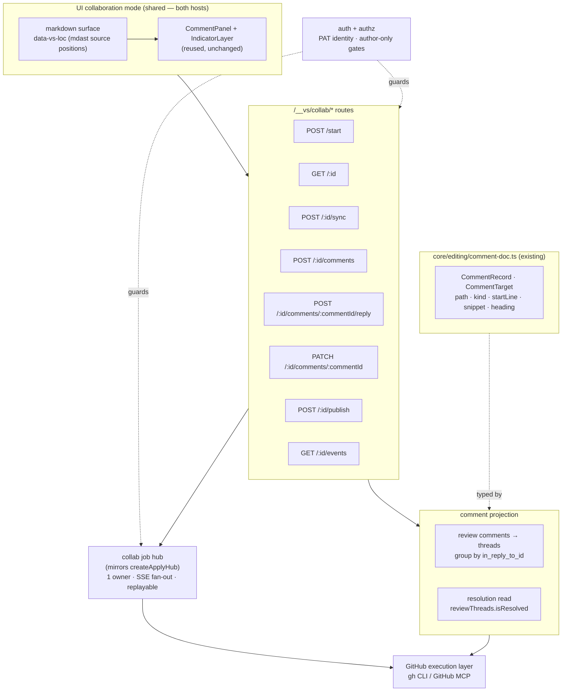
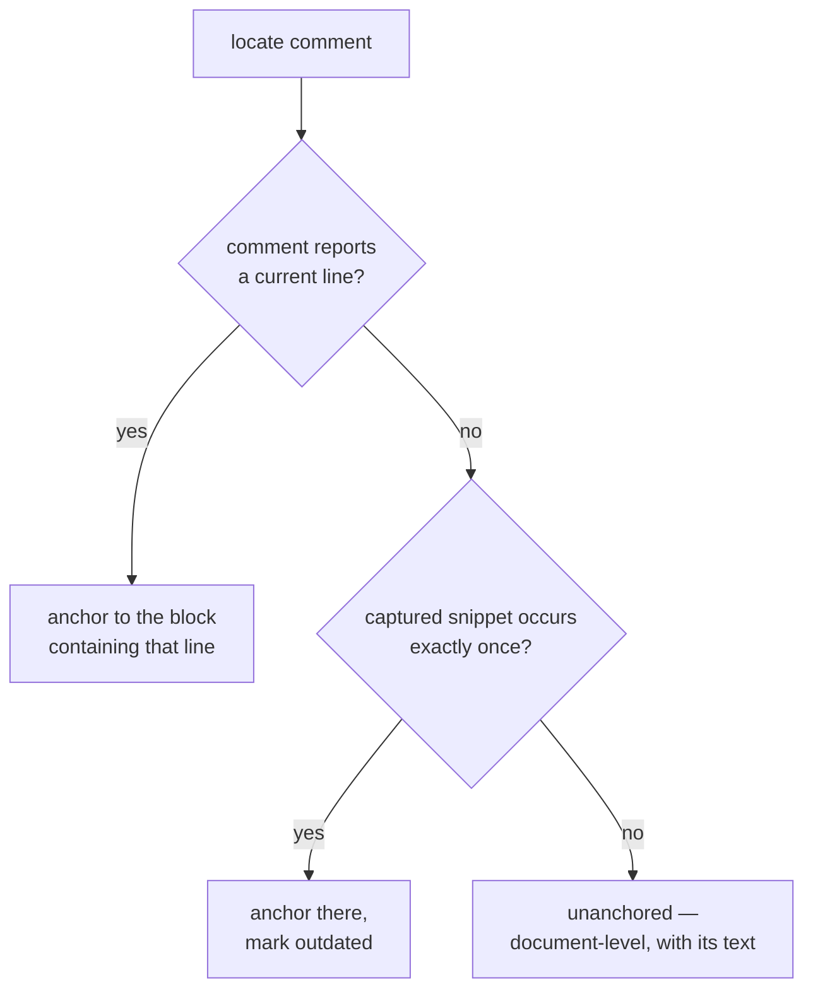

# GitHub PR-Based Collaborative Documents — Low-Level Design

> **Revision — Markdown-native collaboration.** This document previously specified a
> canonical JSON document format with `nodeId` block identity, and comments carried on
> PR *issue* comments with a machine-readable trailer. That design is retired.
> Markdown is the only document format, and the conversation is native PR **review
> comments** anchored to `path` + `line`. See `docs/ears/…` Unit 0.

## Architecture

### Layer map

### 1. No protocol model — the existing comment types carry it

There is no collaboration document type, no node type, no anchor type, and no
collaborative comment target. A GitHub review thread projects onto the
`CommentRecord` / `CommentTarget` shapes that `core/editing/comment-doc.ts` already
defines and that the comment panel, the indicator layer, the anchor resolver, and the
Claude apply prompt already consume.

That is the point of the design, not a convenience: one comment model means one panel,
one resolver, and one apply prompt, in local mode and in collaboration mode alike.

Projection of a thread root:

| `CommentRecord` field | Source |
| --- | --- |
| `id` | `recordIdFor(comment.id)` — the existing `c-<8hex>` ↔ integer bijection |
| `comment` | comment body, verbatim |
| `workflow` | `DEFAULT_WORKFLOW` |
| `status` | always `open` from GitHub; `applied` is written only by the local apply flow |
| `ts` | `created_at` |
| `target.path` | the review comment's `path` |
| `target.kind` | `range` when anchored, `file` when not |
| `target.startLine` | `start_line ?? line` |
| `target.endLine` | `line` |
| `target.snippet` | text at `original_line` in the blob at `original_commit_id`, clamped |
| `target.heading` | nearest heading above the line |

Replies are not records. They hang off the root's projected record, together with the
GitHub identifiers the UI needs — the root's REST integer id (the reply target), the
outdated flag, the thread's `html_url`, the author, and the resolution state read
separately from GraphQL.

**Identity is the REST integer id**, not the GraphQL node id: `in_reply_to_id` is an
integer, the reply endpoint takes an integer path segment, and the existing `c-<8hex>`
bijection that every `/__vs/collab/:id/comments/:commentId` route depends on is built
on it.

### 2. Markdown is the document

There is no canonical structured format. The file on the branch is the file the
reviewer reads and the file the agent edits.

| Concern | Mechanism |
| --- | --- |
| Rendering | the existing markdown surface, which stamps `data-vs-loc` from mdast source positions offset by the frontmatter length |
| Editing | the existing WYSIWYG / source editors, unchanged from local mode |
| Publishing | commit the Markdown bytes to the branch and verify the stored blob |
| Block identity | none — a comment names a line, and GitHub reports when that line no longer exists |

**What this gives up.** A comment can go outdated. The retired design carried a
`nodeId` on every block precisely so a comment survived an edit that moved every line;
that capability is gone, and §6 states exactly what replaces it. This is the central
trade of the revision and it is deliberate: the cost of keeping it was a parallel
document format, a parallel renderer, a parallel resolver, and a PR diff no human
could read.

**One consequence to guard.** The editors round-trip Markdown through Lexical, and
that round trip normalizes formatting — `md-fidelity.ts` already detects and warns
about frontmatter, table, and image degradation. A save that reflows unrelated
prose shifts every line below it and can outdate every open thread in one commit.
Source-first editing for a document under review is the mitigation, and the fidelity
check that already exists is the gate.

### 3. Reading the document — no store

A Markdown document is a file in the local tree, and on the branch it is a blob read
with the adapter's existing `getFile`. There is no `DocumentStore`, no id-addressed
`documents/<id>.json` layout, and no node-location lookup.

**Which copy is rendered matters, and it is not the local one.** While a document is
under review, the UI renders the Markdown *as it stands on the PR branch*. A review
comment is `commit_id` + `path` + `line`; the local copy and the branch are routinely
out of step — that is the normal state of a document an agent has edited and nobody
has published yet, and it is exactly why `contentSha` exists. Rendering the local
buffer and posting its line numbers would attach a reviewer's words to different
prose, silently, with nothing in the UI looking wrong. Review and editing are two
different documents at two different SHAs, and the UI keeps them apart.

### 4. GitHub execution layer

All GitHub access is **server-side**, in the node process. Every operation goes through
one adapter that delegates to the `gh` CLI (`gh api`) or the GitHub MCP server. There
is no hand-rolled HTTP or GraphQL client.

**REST for the conversation.** Three endpoints carry it:

| Operation | Endpoint |
| --- | --- |
| list | `GET /repos/{o}/{r}/pulls/{n}/comments` |
| create | `POST /repos/{o}/{r}/pulls/{n}/comments` |
| reply | `POST /repos/{o}/{r}/pulls/{n}/comments/{comment_id}/replies` |

`commit_id` is **required** on create and must be the Pull Request's current head SHA,
re-read at creation time. A SHA cached from `open` makes the comment outdated the
instant it is posted.

Pagination is an explicit `page=` loop at `per_page=100` — the buffered executor cannot
see `Link` headers — accumulating the whole list before returning it, with a page cap
that throws rather than returning a truncated list. `sort` / `direction` are not
passed: the default `created` ascending is what threading wants.

**GraphQL for one read, and only one.** Resolution state does not exist in the REST
review-comment payload. `PullRequest.reviewThreads` is the only place `isResolved`
lives, so the adapter carries a single narrow GraphQL read for it. Nothing is written
over GraphQL.

That read needs **its own error classifier**. The REST classifier keys on exit code and
an `(HTTP nnn)` marker in stderr; GraphQL reports failures with HTTP 200 and an
`errors` array, so the REST classifier would read a failed query as a successful one.
A failed resolution read degrades to *unknown*, never to *unresolved*.

The adapter takes an injectable executor (default: spawn `gh`). Tests supply a
recorded-response executor instead, mirroring the injectable `spawnClaude` seam in the
apply flow.

### 5. Comment projection

#### The channel: review comments

Comments are native PR review comments on the document's path. A reviewer reading the
Pull Request on github.com sees them inline against the Markdown, and a comment they
write there arrives in the viewer anchored to its line. That symmetry is the reason
the JSON format was retired.

#### Threading

GitHub flattens reply chains server-side: `in_reply_to_id` always names a thread
*root*, never another reply. Verified on `microsoft/vscode#280236` (100 comments, 28
replies, 0 nested, 0 orphans) and `facebook/react#20915` (10 comments, 8 replies, 0
nested). Threading is therefore a single-level grouping:

1. list all pages and concatenate
2. roots are the comments with no `in_reply_to_id`
3. group the rest by `in_reply_to_id`
4. a group whose root is absent — a deleted root — is promoted to a thread of its own
5. project each root, attach its replies ordered by creation time

Grouping runs over the **complete** list. Grouping a page at a time would turn a root
on page 1 with its reply on page 2 into a phantom orphan.

#### Resolution

Read from `reviewThreads.isResolved`, never derived from comment bodies and never
written. The reply-marker convention the retired design used is gone; so is the
trailer protocol, which existed only because issue comments had nowhere to put an
anchor.

Resolving happens on github.com. The UI shows the state and links to the thread.

#### The out-of-diff constraint

GitHub accepts a line-anchored review comment only on a line inside the Pull Request's
diff. A document created by the PR is entirely added, so every line stays commentable
for the PR's life; the constraint bites when reviewing a document that already existed
on base and the PR touched part of it.

The handling is disclosure, not refusal:

- the viewer knows the diff before the user types, and marks which text it covers;
- selecting text outside it states, in the compose form, that the comment will be
  posted against the file rather than the line;
- the posted body quotes the selected text and names its line, so the reference
  survives for a reader on github.com;
- a `422` that still arrives — the head moved mid-session — retries once as a
  file-level comment, says so, and never discards what the user typed.

Refusing was rejected: the most valuable review comment is often about a paragraph the
PR did not touch, and a tool that cannot accept it fails the person it exists for.
Degrading silently was rejected too — the user believed they anchored, and the author
receives a floating objection with no referent.

#### The seam

`CommentDocStore` gains **intent-based methods** — `addComment(): Promise<CommentRecord>`,
`updateComment()`, `deleteComment()` — because `write(doc)` is a whole-document
snapshot swap: a GitHub-backed implementation would have to diff old against new to
infer "one comment was added", and `write` returns `void` so there is nowhere to
return the created comment's id. `handleCommentsRequest` and the apply flow keep
working against the same interface.

`visual-spec-comments.json` survives in collaboration mode strictly as a **local
cache** of GitHub comments, letting the agent read the full conversation when
generating the PR summary and changelog without re-fetching. It is never
authoritative and is deleted once the PR merges.

`status` (`open` / `applied`) records whether the local apply agent has acted on a
comment. It is never derived from GitHub state and never written back — otherwise
someone re-derives it from `isResolved` and quietly reintroduces a second resolution
model.

### 6. Anchor resolution

Collaboration and local mode share **one** resolver. The markdown surface stamps every
rendered block with its source line, and `resolveMarkdownAnchors` already maps a line
range to a block with a heading fallback. A review comment's `path` + `line` +
`start_line` feeds that existing `AnchorTarget` directly.

This inverts the retired design, which mandated two resolvers that must never share
code. Collapsing them is the largest structural win of the revision.

**The outdated case is where this design is judged.** GitHub returns `line: null` and
only `original_line`, against a commit that is no longer current — confirmed on two
independent repositories. `original_line` must never be used as a current position: it
is a line number in a different commit, and using it anchors a reviewer's words to the
wrong paragraph with full confidence.

So: capture the text at `original_line` from the blob at `original_commit_id`, clamp
it, and store it as the comment's `snippet` — a field `CommentTarget` already declares
for exactly this purpose. Re-anchor only on an **exact, unique** match. Zero matches
or several fall to the document-level list, showing the captured text.

Deliberately excluded: fuzzy matching, similarity thresholds, and heading-proximity
scoring. Each adds a way to be confidently wrong, and the unanchored list is an
acceptable landing place. A heading match tells you the section, not the sentence.

Nothing is hidden, an outdated comment renders visually distinct wherever it appears,
and no re-anchoring control is offered — GitHub has no operation that moves a review
comment, so the honest answer is to write a new one.

### 7. Lifecycle jobs

Mirrors `createApplyHub`'s discipline — one process owns the operation, browser tabs
subscribe by SSE, state is replayable — but **not its shape**. `createApplyHub` is a
module-level singleton: one run at a time, globally. Collaboration needs concurrent
per-document jobs, so this becomes a **hub registry keyed by `documentId`**, each entry
holding its own event log and lifecycle state.

Publish commits **one artifact** — the Markdown — and is a two-step server sequence:
commit, then **verify**. Merge is deliberately not part of it: publishing writes to the
PR branch and stops, and merging happens on github.com where reviewers already are.
That removes the irreversible half of the primitive from an unauthenticated localhost
endpoint at no cost to the workflow.

Every step is keyed by a caller-supplied **idempotency key**: a retry after a timeout
that actually succeeded must not produce a second branch, a second PR, or a duplicate
comment. `Failed` is a real state with a recorded step, not an error toast.

**Verification, not regeneration.** Compare the blob GitHub stored against the bytes
the client sent — one `gh api` call and a hash compare. A mismatch means an assumption
broke, and that is a `Failed` state a human must look at, not something to silently
re-derive.

**Base divergence is a different failure and gets its own state.** If base gains a
change to the same path after the branch point, the merge legitimately produces
different content, and reporting that as a verification failure would fire an integrity
alarm on a correct outcome.

**The commit must go through the Contents API, never a local working tree.** Git's
`text=auto` / `eol=lf` filters run at `git add` in a checkout, not on API writes, so a
shell-out to `git commit` would silently normalize line endings and make verification
fail on every publish.

`Ready` is derived from GitHub's own thread resolution, re-verified at merge time
because a comment can arrive between the poll that computed readiness and the merge
request. If resolution could not be read, the document is **not** Ready and the unknown
state is named as the reason — a gate that cannot see its input must not pass.

### 8. Sync

Server-side interval polling plus an explicit "Sync now" action. Both enter through
**one sync entrypoint**, so a webhook receiver could later call the same path without
redesign. Results fan out over SSE on `GET /__vs/collab/:id/events`.

A full read is one REST page loop plus one GraphQL query. The GraphQL query costs one
point against a budget separate from REST's, so resolution reading is cheaper than the
conversation read it accompanies.

### 9. Auth and authorization

Collaboration adds server-side credentials and role checks: PAT (via `GH_TOKEN` /
`gh auth`), repo owner/repo/base branch, and the authenticated identity resolved from
the PAT. Every participant runs their own instance with their own PAT, so the PAT owner
*is* the local user and GitHub attribution is native.

**Two roles.** Authorization is a role derived from the PAT's effective permission on
the repository:

| Role | Derived from | Permitted |
| ---- | ------------ | --------- |
| Author | PAT identity == PR author, with write access | edit, commit, mark ready, publish, merge |
| Reviewer | anything else with read access | read, comment, reply |

Creating and replying to review comments needs no write access, so the reviewer role
works as specified. GitHub itself enforces the boundary: a reviewer's PAT cannot push,
so single-writer holds even if a server check is wrong. Server-side checks remain,
because a reviewer's own instance would otherwise let them *attempt* an author
operation and fail confusingly.

**Local-server exposure — the highest-severity gap, and it predates collaboration.**

`/__vs` is an unauthenticated localhost server. Without origin checking, a cross-origin
`POST` with `Content-Type: text/plain` is a *simple request*, skips preflight, and
parses normally — so any page open in the user's browser can reach
`POST /__vs/comments/add` and `POST /__vs/apply/start`. Since the apply prompt splices
comment text verbatim and the apply route spawns `claude … --permission-mode acceptEdits
--add-dir <cwd>`, that is a path from a hostile tab to an agent with write access to the
working tree.

Publish escalates the same hole from local damage to a **remote write with the author's
GitHub credential**. The trust argument for accepting client bytes — *the author could
`git push` anything* — is true of the author and false of a page exploiting the author's
ambient authority.

**The guard: `Sec-Fetch-Site` plus a `Host` allow-list**, as one shared middleware ahead
of every `/__vs` handler. Reject `cross-site` and `same-site`; allow when the header is
absent, because a client that omits it is not a browser and has no ambient authority to
borrow. This covers `GET`, `POST`, and SSE uniformly — which matters, because
`EventSource` cannot set headers, so any scheme built on a custom header or bearer token
needs a separate story for the events route and tends to end up putting the token in a
query string, where it leaks into logs and `Referer`.

**Host divergence.** Vite's dev server has historically applied permissive CORS
defaults. If those reach `/__vs`, responses become *readable* cross-origin and a blind
write primitive becomes read-plus-write. The guard must be shared code registered ahead
of the plugin's own middlewares, and a test must assert non-readability in both hosts.

### 10. Verified GitHub behaviour

Every claim this design rests on was measured against a real Pull Request:
`metuur-ai/visual-spec-collaboration-test#9`, a document already on `main` whose PR
edits exactly one line. Responses are recorded in
`packages/visual-spec/core/collaboration/fixtures/`.

| Claim | Result |
| --- | --- |
| A comment on a line **inside** the diff is accepted | Created, `line: 23`, `subject_type: line` |
| A comment on a line **outside** the diff is refused | **HTTP 422**, `pull_request_review_thread.line — could not be resolved` |
| `subject_type: file` is accepted with no line | Created, `subject_type: file` |
| A reply lands in the thread | `in_reply_to_id` = root, inherits the root's `path` and `line` |
| Replying **to a reply** still attaches to the root | `in_reply_to_id` = root, not the reply — GitHub flattens server-side |
| An edit outdates a line-anchored thread | `line: null`, only `original_line` survives, against a frozen `original_commit_id` |
| A file-level thread survives the same edit | Not outdated; kept a usable position and advanced its `commit_id` |
| REST exposes resolution state | **No.** No `resolved` field and no thread id on the review-comment payload |
| GraphQL exposes it | `reviewThreads` gives `isResolved`, `isOutdated`, `path`, `line`, `originalLine` |
| The two can be joined | `reviewThreads.comments[].databaseId` **is** the REST integer id |
| Resolving is visible to a later read | Resolved via GraphQL; the next read reports `isResolved: true` with `resolvedBy` |
| GraphQL reports errors with HTTP 200 | Yes — but `gh` exits non-zero whenever `errors` is present, including a partial error that also returns valid `data` |

Two of these changed the design rather than confirming it:

- **A file-level thread does not go outdated.** The out-of-diff fallback is therefore
  not merely a degraded anchor — it is a *more durable* one than a line. That makes it
  a reasonable landing place rather than a consolation prize.
- **`gh` already fails loudly on a GraphQL error.** The earlier concern that the REST
  classifier would read a GraphQL error as success does not hold: the exit code catches
  it. What is genuinely missing is an HTTP-status marker, so a GraphQL failure must not
  be routed through the REST status classifier, and a *partial* error must degrade to
  unknown rather than be mistaken for complete data.

## Constraints

| Constraint | Consequence |
| ---------- | ----------- |
| PAT is the credential | All GitHub calls are server-side. The token must never reach the browser, appear in a response body, or be embedded in an SSE event. Rules out any browser-direct design. |
| Execution via `gh` CLI + GitHub MCP | No bespoke HTTP/GraphQL client. Enables the Claude CLI to drive the same operations in both host workflows. |
| Review comments are diff-positioned | A line-anchored comment is only accepted on a line inside the PR diff. Outside it, the comment is posted against the file with the selected text quoted. |
| Resolution state is GraphQL-only | REST's review-comment payload carries no resolved flag and no thread id. One narrow GraphQL read, with its own error classifier, because GraphQL reports failures with HTTP 200. |
| An outdated comment loses its line | GitHub returns `line: null` and only `original_line` against a dead commit. Re-anchoring is by exact unique snippet match or not at all. |
| The local copy is routinely not the branch copy | The review surface renders the branch's Markdown. Posting local line numbers would silently mis-anchor. |
| Markdown round-trips through Lexical | An editor save can reformat unrelated prose and outdate every open thread at once. Source-first editing under review; the existing fidelity check is the gate. |
| Luthor is UI-only; the CLI carries no browser-ecosystem dependency | `core/` must never import Luthor — esbuild produces a broken artifact that throws on `react-dom/server.node.js`. Enforced by the bundle guard. |
| Reviewers cannot push | Every reviewer-originated action must be expressible as a comment. Creating and replying qualify; resolving happens on github.com. |
| Localhost deployment | GitHub webhooks cannot reach the server without a tunnel. Sync is polling + manual. The server is unauthenticated and needs origin/CSRF protection once it holds a credential. |
| Single writer per document | No CRDT/OT layer exists and none is added. Enforced by GitHub write permission, not by convention. |
| Both hosts share one implementation | Collaboration code lives in the shared UI + `/__vs` route layer; no host-specific branching. |
| Local mode must not regress | Collaboration is additive behind existing seams. Local commenting and the Claude apply flow are the shipped product. |

## Key Decisions

### Markdown as the only format

The file on the branch is the document. There is no canonical JSON, no envelope, and no
block identity of our own.

The reason is not aesthetic. Keeping `nodeId` meant keeping a parallel document format,
a parallel renderer, a parallel anchor resolver, a bespoke resolution protocol built on
reply markers, a dual-artifact publish, and a `.gitattributes` rule whose only job was
to stop reviewers seeing a wall of JSON diff. All of that existed to buy one property —
a comment that never goes outdated — which every GitHub user already lives without.

*Rejected:* giving the JSON envelope a dedicated extension so the viewer could render
it as prose. That is the same format under a different name — it keeps every cost
above and buys only a nicer-looking file tree. Also rejected: a local sidecar holding
the review session beside the `.md`, which has nothing left to hold once the
conversation lives in the pull request.

### Comments as PR review comments, not issue comments

Review comments anchor to `path` + `line` and render inline on the diff, so a reviewer
on github.com participates fully with nothing installed. Issue comments were forced by
the JSON format — a JSON file's lines are not reviewable prose — and required a
machine-readable trailer, hand-rolled threading, and a hand-rolled resolution
convention. All three disappear.

*Rejected:* keeping issue comments for whole-document discussion as a second channel in
v1. They still exist on the PR and are displayed, but the system does not create them.

### Resolution is read, never written

Resolving a thread is GraphQL-only, and the write side needs its own permission story
and its own UI. Reading it is one query and keeps the viewer from contradicting GitHub —
a thread resolved on github.com must not show as open. Writing it is deferred, and the
UI links to the thread instead of offering a control it would have to keep in sync.

*Rejected:* ignoring resolution entirely in v1. The viewer would show resolved threads
as open forever, and the publish Ready gate — which is shipped and which users rely on —
would have no input at all.

### The review surface renders the branch, not the local buffer

A local copy holding unpublished work is the *normal* state of a document under review;
`contentSha` exists because nothing else can answer "does the local copy hold work the
branch has not seen?". Posting comments against local line numbers would attach them to
different prose on the branch, silently, and the result looks correct to everyone
including the author acting on it.

This is the one failure mode the retired design was structurally immune to — `nodeId` is
content identity, so a stale buffer failed loudly as *outdated* or *orphaned*. Line
numbers are positional and fail quietly. Separating the review surface from the edit
surface is what buys the loudness back.

### One anchor resolver, shared with local mode

The markdown surface already stamps source positions and `resolveMarkdownAnchors`
already resolves a line range to a block with a heading fallback. Collaboration uses it
rather than a second implementation. The retired design *required* two resolvers that
never share code; collapsing them removes a whole class of drift.

### Out-of-diff comments degrade, with the disclosure up front

Stated in the compose form before the user types, because the viewer already knows the
diff. A failure discovered after submit is a bad experience; the same fact disclosed
before typing is just information.

### `gh` CLI + GitHub MCP over a hand-rolled client

Makes the Claude CLI a first-class driver of the same operations and avoids
reimplementing auth, pagination, and rate-limit handling. *Rejected:* Octokit or raw
`fetch`, which would need its own credential plumbing and would not be agent-drivable.

### Per-user PAT on each user's own machine

Preserves native GitHub attribution and avoids a multi-tenant credential store.
*Rejected:* a single shared PAT, which collapses every participant into one GitHub
account and forces identity into comment bodies.

### Single-writer editing model, enforced by GitHub permissions

The author edits; collaborators comment. Matches the PR review metaphor and eliminates
write conflicts by construction — and it is enforced by the reviewer's PAT lacking write
access rather than by convention, so a bug in a server check cannot produce a concurrent
write.

### Polling now, webhook-ready seam

Works on localhost with no tunnel. *Rejected:* webhooks as the primary path —
undeliverable to `localhost` without extra infrastructure.

### Sidecar demoted to cache

GitHub is the system of record. The sidecar is a read cache for agent consumption and is
deleted after merge, so it can never drift into being a competing source of truth.

**With one bounded exception, and every writer of the local copy must know it.** An
agent applying review comments edits the local Markdown directly, and it is forbidden to
publish — the run ends at `READY TO PUBLISH:`. Between that edit and the author's
publish, the local copy holds work that exists **nowhere else**: not on the branch, not
in any commit. During that window the local copy is not a cache, and anything that
overwrites it without asking destroys work with no way back.

This is a property of the document, not of whoever is about to write it. So the question
"does this document hold unpublished local work?" belongs to the store, and every
overwriting path asks it rather than each one rediscovering the hazard.

The anchor is `contentSha`: the blob hash of the document as it stood at the last point
local and branch provably agreed — written by create, by open, and by publish once its
bytes are verified. Local content that no longer hashes to it means the copy moved on.
`headSha` cannot serve: it is a commit-level pointer, it is not updated on publish, and
it is blind to a local edit that never became a commit.

## Out of Scope

- Real-time collaborative editing, live cursors, presence indicators
- Writing resolution state; resolving happens on github.com
- Migrating documents authored in the retired JSON format, or a converter for them
- Webhook receiver, tunnel, or public endpoint
- Multi-tenant hosting or any shared-credential deployment
- Remote repository file-tree browsing (`/__vs/tree`, `/__vs/dir`, `/__vs/raw` stay local)
- Changing `CommentTarget` or the sidecar format for local comments
- Migrating existing local comments into GitHub threads
- GitHub App installation flow or OAuth device flow (PAT only)
- GitHub "suggested change" blocks — a proposed diff is a different product surface
- Conflict resolution UI for concurrent branch writes

## Open Questions

**Blocking: none.** The last unverified GitHub behaviour was settled by the spike
recorded in §10.

**Non-blocking.**

- Whether a document under review should be editable in the WYSIWYG editor at all, or
  restricted to source editing while threads are open.
- Whether pre-existing local comments on a document that enters review should offer a
  "post to PR" action, or stay local-only until the review closes.
- Whether `gh` is a hard prerequisite or GitHub MCP is the required path, given the
  standalone CLI cannot assume a configured `gh`.
- Whether the comment cache is keyed per PR so concurrent collaboration sessions do not
  overwrite each other before merge.
