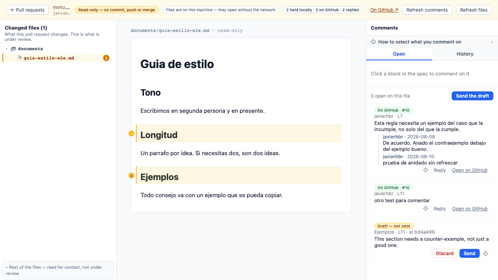
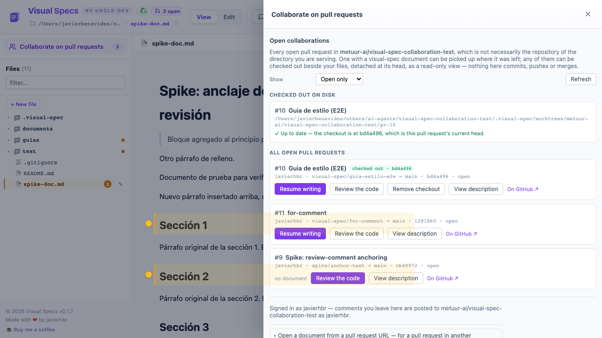

# Visual Spec — a walkthrough

Two jobs, in the order they happen: **write a document** with your own notes until it is
ready, then **collaborate** on it through a GitHub pull request.

Every screenshot here is the real tool running against a real repository
(`metuur-ai/visual-spec-collaboration-test`), not a mockup.

---

## Before you start

```sh
npx @metuur/visual-spec .
```

That is the whole setup. Collaboration turns itself on from the directory's GitHub
`origin` — you do not pass `--repo` unless you want a *different* repository than the one
you are sitting in:

```
  visual-spec
  ➜  dir:      /Users/you/your-specs
  ➜  comments: /Users/you/your-specs/visual-spec-comments.json
  ➜  collab:   your-org/your-specs (from origin — --no-collab to disable)
  ➜  open:     http://localhost:5180
```

If no GitHub credential is configured, collaboration stays off and everything below in
Part 1 still works. Nothing contacts GitHub until you have authenticated, and nothing
contacts it *from the browser* even then — every call is made by the server.

---

# Part 1 — Write a document

## 1. Open the tool on a folder


The sidebar is the folder you pointed at. Above it, **Collaborate on pull requests** with
a count — that is the way in to Part 2, and it is there from the first screen.

The header's top row is where you are: the **repository**, the **branch**, and the
counts. Below it, the directory being served. Hover any chip for the full value; the
repository chip's tooltip carries the full `owner/repo` and the origin URL.

There can be three counts, not one, and they answer different questions:

| Chip | Means |
| --- | --- |
| **N open** | Open pull requests in the collaboration repository |
| **N to review** | …of those, the ones that request *you* as a reviewer |
| **N mentioning you** | …of those, the ones that mention *you* |

A count that is zero, or not yet read, shows nothing at all — so a quiet header means
nothing is waiting on you. Being asked to review blocks someone else's work and being
mentioned asks you to read something, so the two are never added together. A pull request
that is both is counted by both.

Where the collaboration repository is *not* this directory's `origin`, the counts carry
one caption — `on owner/repo` — once for the group. Where they agree, nothing is added.

## 2. Open a file


The header shows three groups, in the order the work happens:

| Zone | What it is for |
| --- | --- |
| **Document** | View or edit the file |
| **Review** | Your notes on it, and sharing it |
| **Agent** | Handing those notes to an agent |

Everything that is not part of the work — changing directory, help, the applied-comment
history — lives behind the **⋯** menu at the far right.

The **Comments** panel opens on the right with the file. **Open** is what is still to do;
**History** is what has already been applied.

## 3. Start commenting


Press **Start comments** in the header, **Start commenting** in the panel, or `I`. The
button says **Commenting…** while it is on, and the document becomes clickable block by
block — click the paragraph or heading your note is about.

## 4. Write the note


The panel says exactly what the note is anchored to — `Sección 2 · line 16` — before you
write a word. **Select all content under this heading** widens it from the heading to the
whole section.

**Apply via** picks the workflow that will carry out the note. `visual-spec` is the
default; `other…` lets you name a different skill, and the choice is stored with the note
rather than decided later.

These are **your notes**. Nothing here is sent anywhere.

## 5. The note is saved locally


Labelled **Your note**, because that is what it is: your own note about your own file,
in a local sidecar file next to the document. The document gets a marker in the margin,
the sidebar marks the file, and the header count goes up.

> **Two kinds of comment, and they never mix.** A **note** is yours and local. A **pull
> request comment** is something you write while collaborating, and belongs on GitHub.
> The tool never turns one into the other by accident.

## 6. Let an agent apply them

The **Agent** zone is the other half of the loop:

- **Copy prompt** — copies a prompt describing every open note, for any agent
- **Apply N comments** — runs the bundled apply-comments skill directly

The count on both is every open note in the directory, not only this file's — the panel's
"N open on this file" is the narrower number.

As notes get applied they stop being open and move to the **History** tab. When a file's
notes have all been applied and none are left open, **Start collaboration** lights up —
that is the tool's way of saying *this looks ready to share*. It is a hint, not a gate;
you can share at any time.

---

# Part 2 — Collaborate

## 7. Share the document


**Start collaboration** creates a branch `visual-spec/<id>`, commits the file, and opens a
pull request. The popover states all of it before you press anything, naming the
repository the pull request will be opened against. The file keeps the path it already
has — it is not copied into a `documents/` folder.

**Document id** is the name the collaboration is resumed by; **Title** is optional and
defaults to it.

## 8. Share several files at once


Under **Also include** are the *other* files you have been leaving notes on. Tick any of
them and they travel on the same branch and the same pull request — one review
conversation instead of one per file. The sentence above updates to say how many files it
is about to commit.

Your open file is the **document** and is stated rather than offered: a collaboration has
exactly one named document, and companions ride along with it.

> Nothing is included because it was offered. The default is your open file alone.

## 9. Find what is under review


**Collaborate on pull requests** opens over the workspace and lists what exists. It names
the repository the rows are of, out loud, because the collaboration repository is
configured independently of the directory you are serving and the two need not be the
same.

Each row offers what it actually can:

| Row shows | Means |
| --- | --- |
| **Resume writing** | This PR carries a visual-spec document — pick it up where it was left |
| **no document** | An ordinary pull request; there is nothing to resume |
| **Review the code** | Check it out beside your files and read it |
| **View description** | Read the pull request body without leaving the panel |
| **checked out · `sha`** | Already checked out, at that commit |

**Show** switches between open, closed and all pull requests. **Refresh** re-reads
everything the panel displays — the listing, the checkouts and both awaiting counts — in
one go; nothing here is polled on a timer, so this is the way to ask. It says so while it
is running, and refuses to start a second one on top.

Two more sections appear above the listing when they have anything to say: **Waiting on
your review** and **You were mentioned**. Those are the same pull requests the header
chips count, with the same actions — a mention row also shows who wrote it and the
passage it appears in, so you do not have to open GitHub to find out what was said. A
pull request that the listing does not contain is still shown, by number and title, with
a link — but it cannot be checked out, and the panel says so rather than offering a button
that would fail.

At the foot: who you are signed in as and where your comments will be posted, and
**Open a document from a pull request URL** — paste a link and work on a pull request in
another repository entirely.

## 10. Check a pull request out


**Review the code** checks the pull request out beside your files, detached at its head.
The banner says **read-only — no commit, push or merge**, and means it. Beside it: the
files are on this machine and open without the network, and a tally of the conversation —
how many comments are held locally, how many are on GitHub, how many replies.

**Changed files** is what the pull request changes — the point of the review. The rest of
the checkout is one disclosure below, for context.

## 11. Read a file, and read the conversation on it


The panel shows the pull request's own comments, each labelled **On GitHub · #N** with
its author and line, replies nested underneath. **Reply** answers in the thread;
**Open on GitHub** goes to that exact comment.

## 12. Comment on it


**Start commenting** works here exactly as it does on your own files: click the block,
and the comment anchors to the line it sits on. You do not have to switch to a source
view to reach a line.



Comments you write here are **drafts** — held locally, labelled **Draft — not sent**, and
stamped with the commit you wrote them against. Each has **Discard** and **Send**, and
**Send the draft** at the top of the panel sends them together. Sending is always
something you do on purpose.

## 13. Know what you have checked out



**Checked out on disk** appears in the panel once anything is. It lists every checkout,
whether or not its pull request is still in the listing — which is the case a badge on a
row cannot cover, because a merged pull request takes its row and its **Remove checkout**
button with it.

Each one says whether it is still current: **✓ Up to date** with the commit, or both
commits named and the note that checking the pull request out again moves it to the head.
A word and a mark, not just a colour. Where the pull request is not in the listing, the
panel declines to guess — it has nothing to compare against — and offers to remove the
checkout instead.

---

## The words this tool uses

Terms that mean one specific thing. The full list is in
[`docs/ubiquitous-language.md`](../ubiquitous-language.md).

| Term | Means |
| --- | --- |
| **Note** | Your own local note about your own file. Never leaves your machine on its own. |
| **Pull request comment** | Written while collaborating, belongs on GitHub. |
| **Draft** | A pull request comment written but not yet sent. |
| **Send** | Moves a draft to GitHub. |
| **Start collaboration** | **Creates** a branch, a commit and a pull request. |
| **Collaborate on pull requests** | **Lists** what already exists, to resume or review. |
| **Checkout** | A read-only working copy of a pull request, beside your files. |
| **Publish** | Commits a collaboration document to its branch. |

The distinction that matters most: a verb that names *finding* is never attached to a
control that *creates*.
