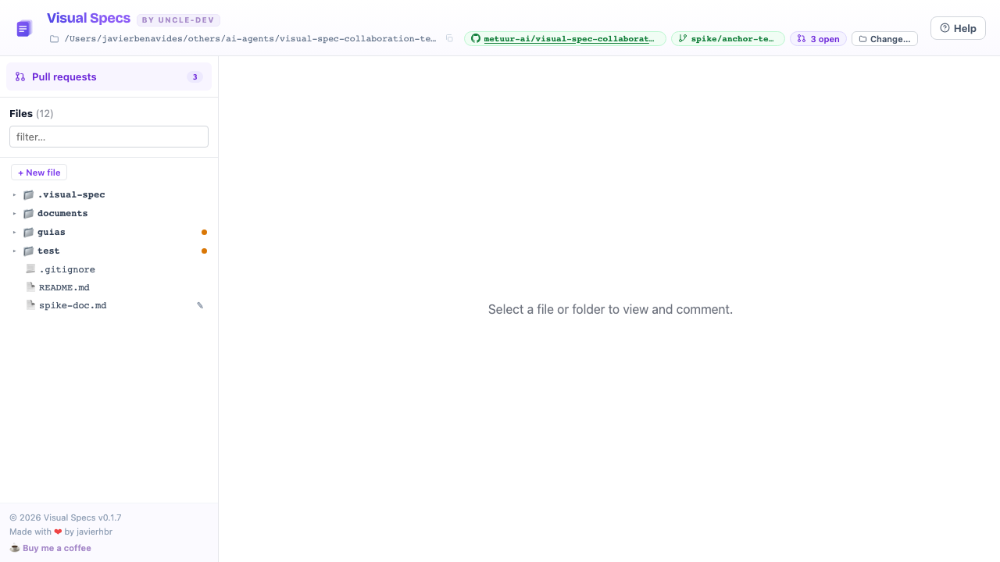
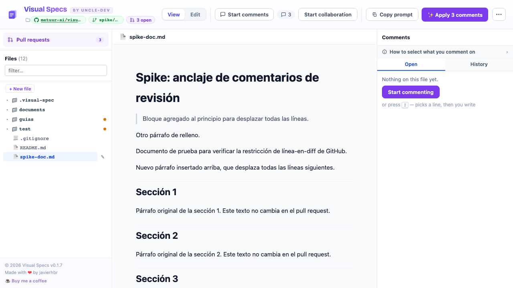
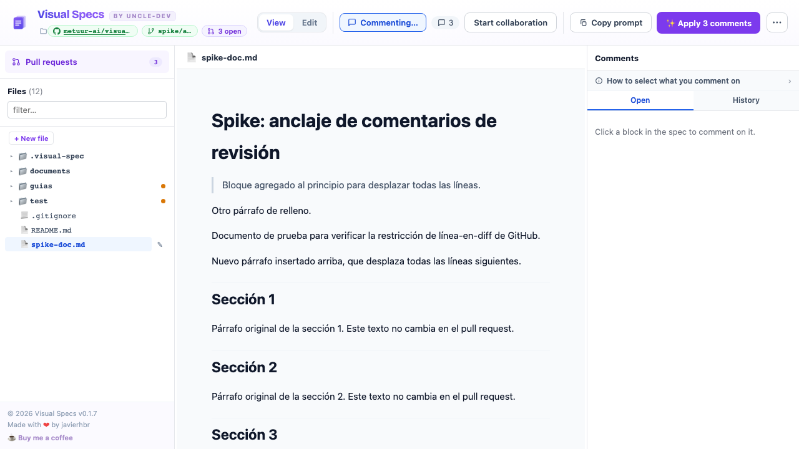
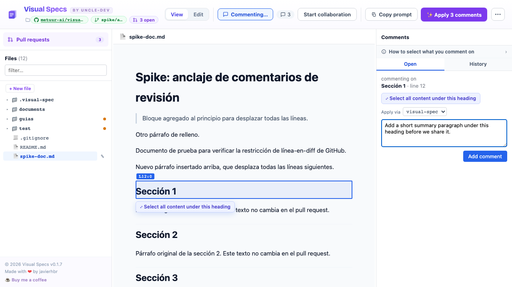
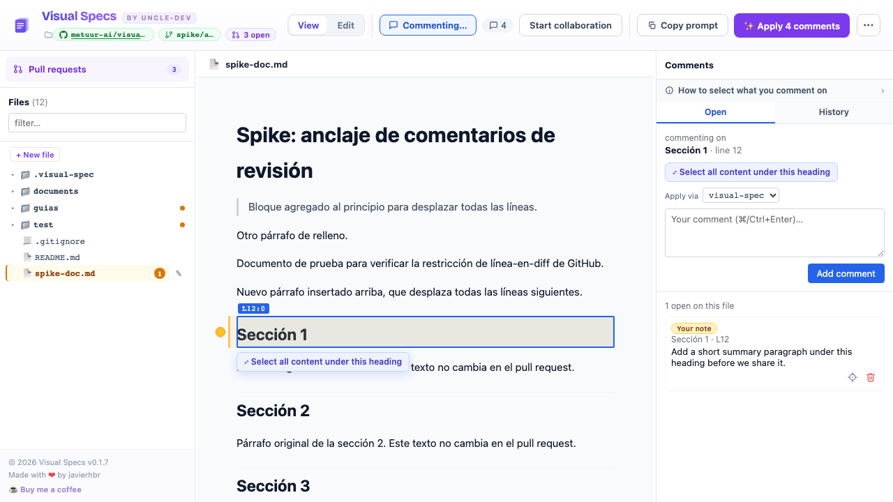
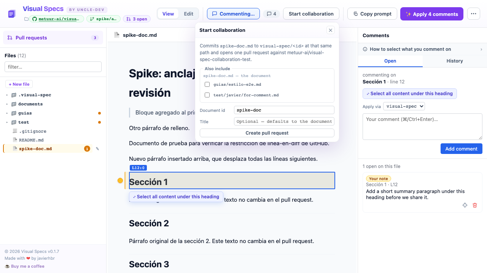
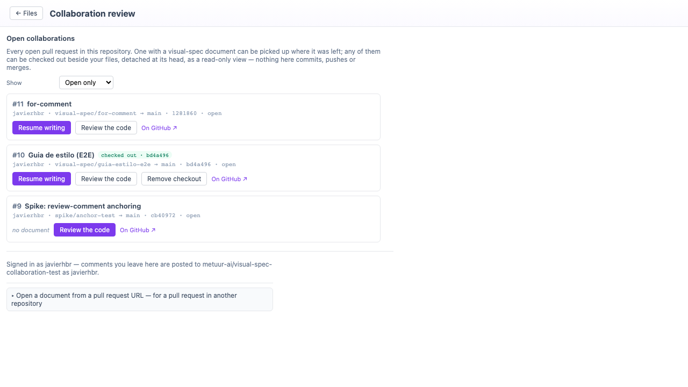
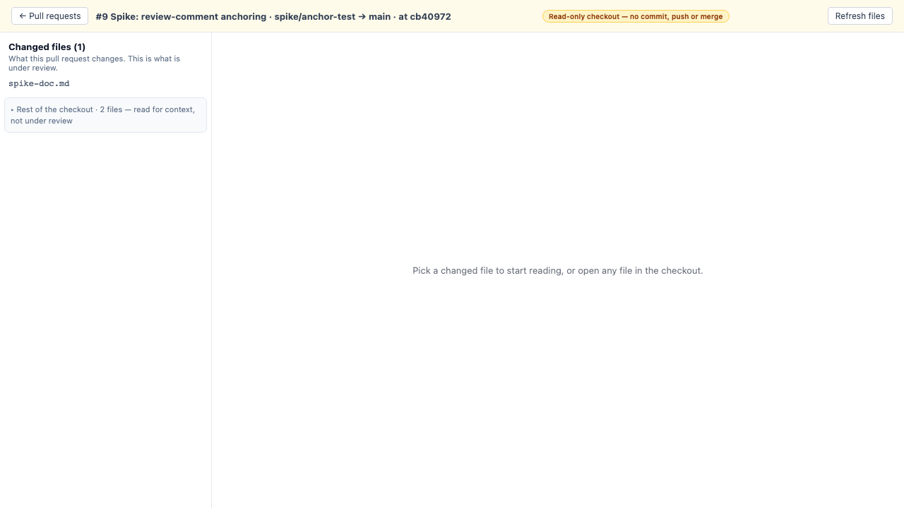
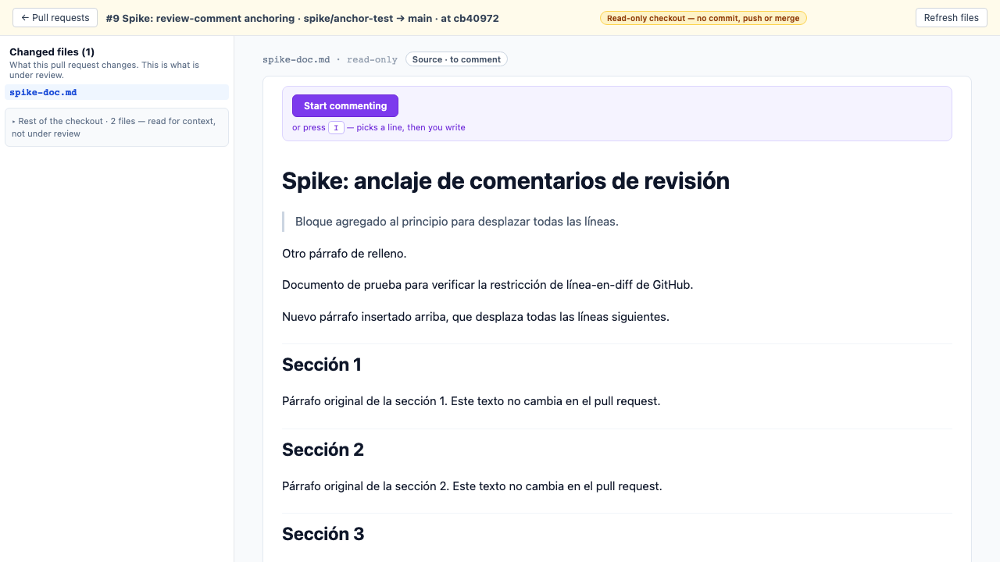
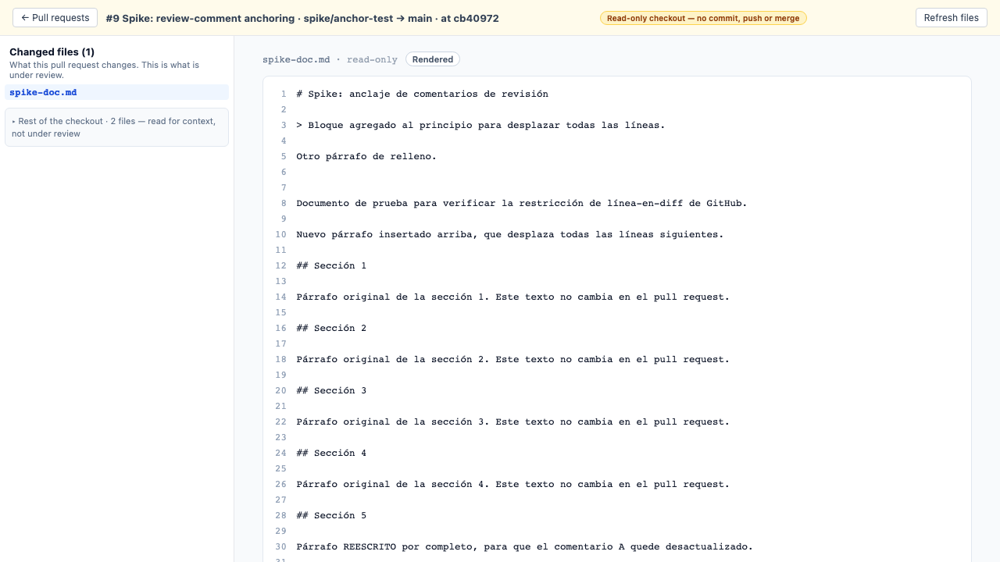

# Visual Spec — a walkthrough

Two jobs, in the order they happen: **write a document** with your own notes until it is
ready, then **collaborate** on it through a GitHub pull request.

Every screenshot here is the real tool running against a real repository
(`metuur-ai/visual-spec-collaboration-test`), not a mockup.

---

## Before you start

```sh
npx @metuur/visual-spec .
```

That is the whole setup. Collaboration turns itself on from the directory's GitHub
`origin` — you do not pass `--repo` unless you want a *different* repository than the one
you are sitting in:

```
  visual-spec
  ➜  dir:      /Users/you/your-specs
  ➜  collab:   your-org/your-specs (from origin — --no-collab to disable)
  ➜  open:     http://localhost:5180
```

If no GitHub credential is configured, collaboration stays off and everything below in
Part 1 still works. Nothing contacts GitHub until you have authenticated.

---

# Part 1 — Write a document

## 1. Open the tool on a folder



The sidebar is the folder you pointed at. Above it, **Pull requests** with a count — that
is the way in to Part 2, and it is there from the first screen.

Top right, three chips describe where you are: the **repository**, the **branch**, and the
**open pull request count**. Hover any of them for the full value; the repository chip's
tooltip carries the full `owner/repo` and the origin URL.

## 2. Open a file



The header now shows three groups, in the order the work happens:

| Zone | What it is for |
| --- | --- |
| **Document** | View or edit the file |
| **Review** | Your notes on it, and sharing it |
| **Agent** | Handing those notes to an agent |

## 3. Start commenting



Press **Start commenting** (or `I`). The document becomes clickable block by block —
click the paragraph or heading your note is about.

## 4. Write the note



The panel says exactly what the note is anchored to — `Sección 1 · line 12` — before you
write a word. **Select all content under this heading** widens it from the heading to the
whole section.

These are **your notes**. Nothing here is sent anywhere.

## 5. The note is saved locally



Labelled **Your note**, because that is what it is: your own note about your own file,
in a local sidecar file next to the document. The sidebar marks the file, and the header
count goes up.

> **Two kinds of comment, and they never mix.** A **note** is yours and local. A **pull
> request comment** is something you write while collaborating, and belongs on GitHub.
> The tool never turns one into the other by accident.

## 6. Let an agent apply them

The **Agent** zone is the other half of the loop:

- **Copy prompt** — copies a prompt describing every open note, for any agent
- **Apply N comments** — runs the bundled apply-comments skill directly

As notes get applied they stop being open. When a file's notes have all been applied and
none are left open, **Start collaboration** lights up — that is the tool's way of saying
*this looks ready to share*. It is a hint, not a gate; you can share at any time.

---

# Part 2 — Collaborate

## 7. Share the document



**Start collaboration** creates a branch `visual-spec/<id>`, commits the file, and opens a
pull request. The file keeps the path it already has — it is not copied into a
`documents/` folder.

## 8. Share several files at once


Under **Also include** are the *other* files you have been leaving notes on. Tick any of
them and they travel on the same branch and the same pull request — one review
conversation instead of one per file.

Your open file is the **document** and is stated rather than offered: a collaboration has
exactly one named document, and companions ride along with it.

> Nothing is included because it was offered. The default is your open file alone.

## 9. Find what is under review



**Pull requests** in the sidebar lists every open pull request in the repository. Each row
offers what it actually can:

| Row shows | Means |
| --- | --- |
| **Resume writing** | This PR carries a visual-spec document — pick it up where it was left |
| **no document** | An ordinary pull request; there is nothing to resume |
| **Review the code** | Check it out beside your files and read it |
| **checked out · `sha`** | Already checked out, at that commit |

## 10. Check a pull request out



**Review the code** checks the pull request out beside your files, detached at its head.
The banner says **read-only — no commit, push or merge**, and means it.

**Changed files** is what the pull request changes — the point of the review. The rest of
the checkout is one disclosure below, for context.

## 11. Read a file, then comment on it





Rendered to read; **Source · to comment** to leave a comment, because a pull request
comment anchors to a line in the diff. Click a line, or shift-click for a range.

Comments you write here are **drafts** — held locally, labelled as not sent, until you
send them. Sending is always something you do on purpose.

---

## The words this tool uses

Terms that mean one specific thing. The full list is in
[`docs/ubiquitous-language.md`](../ubiquitous-language.md).

| Term | Means |
| --- | --- |
| **Note** | Your own local note about your own file. Never leaves your machine on its own. |
| **Pull request comment** | Written while collaborating, belongs on GitHub. |
| **Draft** | A pull request comment written but not yet sent. |
| **Send** | Moves a draft to GitHub. |
| **Start collaboration** | **Creates** a branch, a commit and a pull request. |
| **Pull requests** | **Lists** what already exists, to resume or review. |
| **Publish** | Commits a collaboration document to its branch. |

The distinction that matters most: a verb that names *finding* is never attached to a
control that *creates*.
